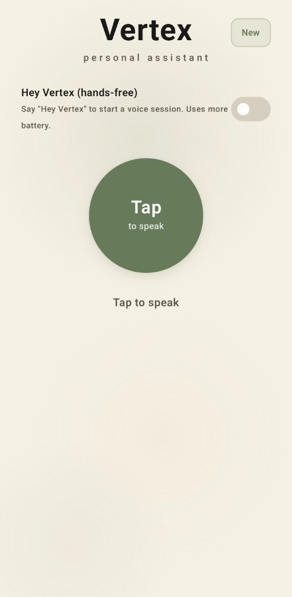

# Vertex

Self-hosted **voice-first personal assistant**: an Android client talks to a **FastAPI** backend that runs a **LangGraph** agent with **OpenAI** and **MCP** (Model Context Protocol) tool servers. You choose which integrations to enable; each tool is a small process the backend spawns and exposes to the model.

<p align="center">
  
</p>

---

## What it does

- **Voice loop** — Speech in, model reply, **TTS** out (OpenAI TTS by default, or Google Cloud TTS for Indian English / Hindi when configured).
- **Tool use** — The model can call **weather**, **web search**, **Spotify**, **Google Calendar / Gmail**, **Maps** (directions, places, transit), **stocks**, **GitHub**, **WhatsApp** (via a local bridge), and **notifications** (device notification log), depending on what you enable.
- **Memory** — Long-term facts in **SQLite** (`backend/data/`), optional seed from `personal_context.md`.
- **Delegation** — Optional WhatsApp “side agent” with escalation and **FCM** push to your phone (Firebase).

---

## Architecture

| Piece | Role |
|--------|------|
| `android/` | Kotlin / Jetpack Compose UI, voice pipeline, optional Picovoice wake word, Firebase for FCM |
| `backend/app/` | FastAPI API, JWT auth, `VertexAgent` (LangGraph ReAct), MCP host |
| `backend/mcp_servers/` | One folder per MCP server; each runs as **stdio** MCP subprocess |

The backend reads `backend/.env`, starts only the MCP servers for which you’ve supplied keys/flags, and attaches their tools to the agent.

---

## MCP servers (tools)

Servers are registered in `backend/app/main.py` (`_build_mcp_configs`). Roughly:

| MCP name | Python / process | When it loads | Credentials / setup |
|----------|------------------|----------------|------------------------|
| **weather** | `mcp_servers/weather/server.py` | `OPENWEATHERMAP_API_KEY` set | [OpenWeatherMap API](https://openweathermap.org/api) (free tier) |
| **search** | `mcp_servers/search/server.py` | `TAVILY_API_KEY` set | [Tavily](https://tavily.com) |
| **spotify** | `mcp_servers/spotify/server.py` | `SPOTIFY_CLIENT_ID` (and secret, refresh token) set | [Spotify Dashboard](https://developer.spotify.com/dashboard): create app, set redirect URI (e.g. `http://localhost:8888/callback`), then run `python mcp_servers/spotify/get_refresh_token.py` and put `SPOTIFY_REFRESH_TOKEN` in `.env` |
| **whatsapp** | `mcp_servers/whatsapp/server.py` | `WHATSAPP_ENABLED=true` | Local **bridge**: `cd mcp_servers/whatsapp && npm install && node bridge.js`. Set `WHATSAPP_BRIDGE_URL`, `VERTEX_BACKEND_URL` for webhooks. See `mcp_servers/whatsapp/`. |
| **notifications** | `mcp_servers/notifications/server.py` | **Always** (no API key) | Writes/reads `backend/data/notifications.jsonl` (from the Android notification capture flow) |
| **calendar** | `mcp_servers/calendar/server.py` | `GOOGLE_ENABLED=true` | Google **OAuth** desktop client: copy `google_credentials.json.example` → `google_credentials.json`, run `python mcp_servers/google_auth.py`, produces `google_token.json` |
| **gmail** | `mcp_servers/gmail/server.py` | `GOOGLE_ENABLED=true` | Same OAuth flow as calendar |
| **stocks** | `mcp_servers/stocks/server.py` | **Always** (no API key) | Uses `yfinance` in-process |
| **maps** | `mcp_servers/maps/server.py` | `GOOGLE_MAPS_API_KEY` set | [Google Cloud Console](https://console.cloud.google.com): enable **Directions**, **Places**, **Geocoding** (and billing as required), create API key with restrictions |
| **github** | `npx @modelcontextprotocol/server-github` | `GITHUB_TOKEN` set | [GitHub PAT](https://github.com/settings/tokens) with appropriate scopes (e.g. `repo` for private repos) |

Optional prompt tuning: set `GITHUB_USERNAME` so “my repos” resolves without asking.

**TTS (not MCP, but related):** For Google Cloud TTS (e.g. `en-IN` / `hi-IN`), enable **Cloud Text-to-Speech**, create a service account key, and set `GOOGLE_APPLICATION_CREDENTIALS` (or rely on the same key you use for Firebase admin if applicable). If unset or `TTS_USE_GOOGLE=false`, the backend uses OpenAI TTS.

**FCM (not MCP):** For push when someone escalates on WhatsApp, use a Firebase **service account** JSON and set `FIREBASE_CREDENTIALS_PATH` or `GOOGLE_APPLICATION_CREDENTIALS` as in `.env.example`.

---

## Quick start (backend)

```bash
cd backend
python3 -m venv .venv
source .venv/bin/activate   # Windows: .venv\Scripts\activate
pip install -r requirements.txt

cp .env.example .env
# Edit .env: OPENAI_API_KEY, JWT_SECRET, and any MCP keys you want (see table above)

# WhatsApp contact aliases for the model (optional)
cp data/contacts.example.json data/contacts.json

# Optional memory seed
cp data/personal_context.md.example data/personal_context.md

# Google Calendar/Gmail (optional)
cp mcp_servers/google_credentials.json.example mcp_servers/google_credentials.json
# Put OAuth client JSON from Google Cloud, then:
python mcp_servers/google_auth.py
```

Run (default port **9000**, overridable with `PORT`):

```bash
./run.sh
# or: uvicorn app.main:app --host 0.0.0.0 --port 9000
```

---

## Android app

1. Create a Firebase project and add an Android app; download **`google-services.json`** to `android/app/` (see `google-services.json.example`).
2. Set backend URL: `BACKEND_URL` in `gradle.properties` or edit the default in `app/build.gradle.kts`.
3. **Picovoice** wake word: set `PICOVOICE_ACCESS_KEY` in `gradle.properties` if you use the bundled wake-word asset (see app `assets/`).
4. Open `android/` in Android Studio and run.

Use **HTTPS** or cleartext rules consistent with `network_security_config.xml` for your server URL.

---

## Personal data and secrets

Local-only paths (see root `.gitignore`): `backend/.env`, `data/contacts.json`, `personal_context.md`, `delegation.json`, `fcm_tokens.json`, `vertex_memory.db`, Google OAuth/token JSON under `mcp_servers/`, Android `google-services.json`, etc. **Do not commit them.** Use the `*.example` files in the repo as templates.

If this repository ever contained secrets in **git history**, read [docs/OPEN_SOURCE_SANITIZATION.md](docs/OPEN_SOURCE_SANITIZATION.md).

---

## License

MIT — see [LICENSE](LICENSE).

---

## Project status

Phase 1: Voice loop MVP (in progress).
